# GitHub Profile Component Gallery

This is a visual playground for the components considered for the `hellonish` profile. Every section renders the real component directly. Personalized widgets use the `hellonish` account wherever the provider supports it.

> [!NOTE]
> Dynamic widgets depend on third-party public services. If a personalized preview is temporarily rate-limited, use the provider-owned reference preview beside it or open the linked configurator.

## Contents

1. [Custom terminal banner](#1-custom-terminal-banner)
2. [Shields.io badges](#2-shieldsio-badges)
3. [Profile view counter](#3-profile-view-counter)
4. [Skill Icons](#4-skill-icons)
5. [GitHub Profile Summary Cards](#5-github-profile-summary-cards)
6. [GitHub Readme Stats](#6-github-readme-stats)
7. [GitHub Activity Graph](#7-github-activity-graph)
8. [Contribution Snake](#8-contribution-snake)
9. [Readme Typing SVG](#9-readme-typing-svg)
10. [GitHub Streak Stats](#10-github-streak-stats)
11. [GitHub Profile Trophy](#11-github-profile-trophy)
12. [Capsule Render](#12-capsule-render)
13. [Lowlighter Metrics](#13-lowlighter-metrics)

---

## 1. Custom terminal banner

The current custom-built component. It provides complete control over text, animation, typography, dimensions, and colors without depending on a rendering service.

<p align="center">
  
</p>

**Useful controls:** SVG `width` and `height`, background and border colors, prompt text, subtitle, cursor behavior, reveal timing, sweep animation, and reduced-motion handling.

---

## 2. Shields.io badges

[Provider and configurator](https://shields.io/badges/static-badge)

### Available styles

| `flat` | `flat-square` | `plastic` |
|:---:|:---:|:---:|
|  |  |  |

| `for-the-badge` | `social` | Brand-matched custom colors |
|:---:|:---:|:---:|
|  |  |  |

### Suggested contact row

<p align="center">
  <a href="https://www.linkedin.com/in/nishantsh20/"></a>
  <a href="https://www.hellonish.dev"></a>
  <a href="https://github.com/hellonish?tab=followers"></a>
</p>

**Useful controls:** `style`, `label`, `color`, `labelColor`, `logo`, `logoColor`, `logoSize`, and `cacheSeconds`.

---

## 3. Profile view counter

[Provider documentation](https://github.com/antonkomarev/github-profile-views-counter)

| Flat | Flat square | For the badge | Abbreviated |
|:---:|:---:|:---:|:---:|
|  |  |  |  |

**Useful controls:** `color`, `style`, `label`, `base`, and `abbreviated`. The provider also offers a hidden `pixel` style.

---

## 4. Skill Icons

[Provider and icon catalog](https://github.com/tandpfun/skill-icons)

### Dark theme

<p align="center">
  
</p>

### Light theme

<p align="center">
  
</p>

### Automatic light/dark switching

<p align="center">
  <picture>
    <source media="(prefers-color-scheme: dark)" srcset="https://skillicons.dev/icons?i=python,ts,react,nextjs,fastapi,postgres,redis,docker&amp;theme=dark" />
    
  </picture>
</p>

**Useful controls:** icon IDs and order, `theme=dark|light`, and `perline=1–50`.

---

## 5. GitHub Profile Summary Cards

[Provider documentation and themes](https://github.com/vn7n24fzkq/github-profile-summary-cards)

### Full-width profile details

<picture>
  <source media="(prefers-color-scheme: dark)" srcset="https://github-profile-summary-cards.vercel.app/api/cards/profile-details?username=hellonish&amp;theme=github_dark&amp;title_color=38bdf8&amp;text_color=7c8fa8&amp;icon_color=27c93f&amp;chart_color=38bdf8&amp;border_color=1f2a37&amp;bg_color=0d1117&amp;animation=draw" />
  
</picture>

### Individual card types

<p align="center">
  
  
</p>

<p align="center">
  
  
</p>

### Theme samples

| `github_dark` | `tokyonight` | `transparent` |
|:---:|:---:|:---:|
|  |  |  |

**Useful controls:** card type, theme, `title_color`, `text_color`, `bg_color`, `border_color`, `icon_color`, `chart_color`, `hide_logo`, `exclude`, `exclude_repos`, `utcOffset`, `animation`, and `duration`.

---

## 6. GitHub Readme Stats

[Provider documentation and themes](https://github.com/anuraghazra/github-readme-stats)

> [!IMPORTANT]
> The shared public deployment can rate-limit. These are personalized live URLs; self-hosting is available if a chosen card needs guaranteed availability.

### General statistics

<p align="center">
  
</p>

### Language layouts

<p align="center">
  
  
</p>

### Repository cards

<p align="center">
  <a href="https://github.com/hellonish/singularity"></a>
  <a href="https://github.com/hellonish/Finassistant"></a>
</p>

**Useful controls:** stats shown or hidden, icons, rank style, theme, gradients, custom colors, border visibility and radius, locale, top-language layout, language count, repository exclusions, language weighting, and repository card description height.

---

## 7. GitHub Activity Graph

[Provider documentation and themes](https://github.com/Ashutosh00710/github-readme-activity-graph)

### Personalized branded graph

<picture>
  <source media="(prefers-color-scheme: dark)" srcset="https://github-readme-activity-graph.vercel.app/graph?username=hellonish&amp;bg_color=0d1117&amp;color=7c8fa8&amp;title_color=38bdf8&amp;line=38bdf8&amp;point=27c93f&amp;area=true&amp;area_color=0ea5e9&amp;hide_border=true&amp;radius=10&amp;height=280&amp;days=45" />
  
</picture>

### Provider-owned `github-compact` reference


**Useful controls:** theme, background, title, text, line, point, area and border colors, area visibility, border visibility, radius, height, days, date range, grid, and custom title.

---

## 8. Contribution Snake

[Provider documentation and interactive demo](https://github.com/Platane/snk)

<p align="center">
  <picture>
    <source media="(prefers-color-scheme: dark)" srcset="https://raw.githubusercontent.com/hellonish/hellonish/output/github-snake-dark.svg" />
    
  </picture>
</p>

**Useful controls:** `palette=github|github-dark|github-light`, `color_snake`, five `color_dots` values, GIF `color_background`, and SVG or GIF output.

Suggested branded palette:

```yaml
outputs: |
  dist/github-snake.svg?color_snake=#38bdf8&color_dots=#ebedf0,#bae6fd,#7dd3fc,#38bdf8,#0284c7
  dist/github-snake-dark.svg?color_snake=#38bdf8&color_dots=#161b22,#0c4a6e,#0369a1,#0ea5e9,#38bdf8
```

---

## 9. Readme Typing SVG

[Provider configurator](https://readme-typing-svg.demolab.com/demo/)

### Terminal-style rotation

<p align="center">
  
</p>

### Green terminal prompt

<p align="center">
  
</p>

### Multiline, one-pass variant

<p align="center">
  
</p>

**Useful controls:** lines, font family, font size, text and background colors, dimensions, duration, pause, centering, multiline mode, repeat, separator, and letter spacing.

---

## 10. GitHub Streak Stats

[Provider configurator](https://streak-stats.demolab.com/demo/)

### Personalized light/dark card

<p align="center">
  <picture>
    <source media="(prefers-color-scheme: dark)" srcset="https://streak-stats.demolab.com?user=hellonish&amp;theme=github-dark-blue&amp;hide_border=true&amp;ring=38BDF8&amp;fire=27C93F&amp;currStreakLabel=38BDF8&amp;timezone=America%2FNew_York" />
    
  </picture>
</p>

### Provider-owned theme references

| Default | Dark | Transparent |
|:---:|:---:|:---:|
|  |  |  |

**Useful controls:** theme, detailed colors for ring/fire/numbers/labels/dates, gradient background, border and radius, locale, timezone, date format, daily or weekly mode, excluded days, card dimensions, sections, starting year, and animation.

---

## 11. GitHub Profile Trophy

[Provider documentation and themes](https://github.com/ryo-ma/github-profile-trophy)

### Wide terminal-friendly layout

<p align="center">
  
</p>

### Theme comparison

| `gitdimmed` | `tokyonight` | `matrix` |
|:---:|:---:|:---:|
|  |  |  |

**Useful controls:** theme, rank inclusion/exclusion, row and column count, adaptive columns, title exclusion, `no-frame`, `no-bg`, and horizontal/vertical margins.

---

## 12. Capsule Render

[Provider documentation](https://github.com/kyechan99/capsule-render)

### `rect` — restrained terminal header


### `waving` — conventional profile header


### `venom` — high-energy variant


### `transparent` — minimal typography


**Useful controls:** shape type, solid/automatic/gradient/custom-gradient color, theme, header or footer section, reversal, height, text, description, text background, animations, font family/color/size, and text/description alignment.

---

## 13. Lowlighter Metrics

[Provider documentation and plugin catalog](https://github.com/lowlighter/metrics)

### Personalized live classic render

<p align="center">
  
</p>

### Provider-owned classic reference

<p align="center">
  
</p>

### Provider-owned terminal reference

<p align="center">
  
</p>

**Useful controls:** classic/repository/Markdown/community templates, base sections, display size, timezone, repositories, and plugins for languages, isometric calendar, recent activity, habits, achievements, notable contributions, lines changed, stars, topics, code snippets, WakaTime, LeetCode, Steam, music, and many more. Advanced configurations are normally generated through GitHub Actions.

---

## Brand palette used in this gallery

| Role | Dark mode | Light mode |
|---|---:|---:|
| Background | `0d1117` | `f6f8fa` |
| Border | `1f2a37` | `d0d7de` |
| Primary cyan | `38bdf8` | `0969da` |
| Success green | `27c93f` | `1a7f37` |
| Muted text | `7c8fa8` | `57606a` |
| Main text | `e6edf3` | `24292f` |

This file is intentionally a gallery rather than the final profile composition. Components selected for the main README should be copied from here and reduced to one coherent visual story.
