  

 

<a href="https://github.com/hellonish?tab=repositories">
  <picture>
    <source media="(prefers-color-scheme: dark)" srcset="./assets/terminal.svg" />
    
  </picture>
</a>

## Evidence

  <picture>
    <source media="(prefers-color-scheme: dark)" srcset="https://profilekit.vercel.app/api/stats?username=hellonish&amp;theme=dark" />
    
  </picture>
  <picture>
    <source media="(prefers-color-scheme: dark)" srcset="https://profilekit.vercel.app/api/languages?username=hellonish&amp;theme=dark" />
    
  </picture>

## Contribution patterns

<picture>
  <source media="(prefers-color-scheme: dark)" srcset="./assets/profile-cards/contributions.dark.svg" />
  
</picture>

<picture>
  <source media="(prefers-color-scheme: dark)" srcset="./assets/profile-cards/rhythm.dark.svg" />
  
</picture>

## This week

  

---

  <strong>Have an ambitious system to build?</strong>
    
  <a href="https://www.hellonish.dev">Portfolio</a>
   · 
  <a href="https://www.linkedin.com/in/nishantsh20/">LinkedIn</a>

